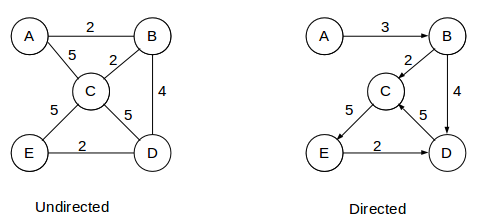

**📌 Overview**

`MixedGraph.h` extends `GraphMatrix.h` to represent **mixed graphs**, which contain **both directed and undirected edges**.

**🔹 Key Features**  
✅ **Supports Mixed Graphs:** Handles both directed and undirected edges.  
✅ **Template-Based Design:** Allows flexible customization of vertex and edge types.  
✅ **Degree Calculation Functions:** Provides methods for **in-degree**, **out-degree**, and **total-degree** calculations.  

---

# **📌 Structure of `MixedGraph.h`**

**🔹 Templates Used**
cpp
template <typename VertexType, typename EdgeType>
class MixedGraphMatrix : public GraphMatrix<VertexType, EdgeType> {}

VertexType: Defines the type of vertices (e.g., int, std::string).
EdgeType: Defines the type of edge weights (int, double, etc.).

🔹 Class Definition:
template <typename VertexType, typename EdgeType>
class MixedGraphMatrix : public GraphMatrix<VertexType, EdgeType> {
public:
    void addEdge(const VertexType& src, const VertexType& dest, EdgeType weight, bool isDirected);
    int getTotalDegree(const VertexType& vertex);
    int getInDegree(const VertexType& vertex);
    int getOutDegree(const VertexType& vertex);
};

📌 Important Components: 

Component	       Description
adjacencyMatrix	   A 1D vector (flattened 2D adjacency matrix) storing both directed and undirected edges.
vertexToIndex	   Maps a vertex to its corresponding index in the adjacency matrix.
indexToVertex	   Maps an index back to its original vertex.

📌 How MixedGraph.h Works:

1️⃣ Adding a Directed Edge
Updates the adjacency matrix only for src → dest.
2️⃣ Adding an Undirected Edge
Updates the adjacency matrix twice:
src → dest
dest → src (since the edge is undirected).

📌 Diagram of Directed vs. Undirected Edge Storage:

3️⃣ Degree Calculation
getInDegree(vertex) → Counts incoming edges.
getOutDegree(vertex) → Counts outgoing edges.
getTotalDegree(vertex) → Sum of in-degree and out-degree.

📌 Example: Degree Calculation in a Mixed Graph
Consider this Mixed Graph:
A → B
B → C
C -- A (Undirected)

Vertex	In-Degree	Out-Degree	Total-Degree
  A	       1	       1	         2
  B	       1	       1	         2
  C	       1	       1	         2  

📌 Connections to Other Files: 

🔹 Dependencies: 
1️⃣ GraphMatrix.h → Provides the core adjacency matrix structure.
2️⃣ GraphAlgorithms.h → Implements DFS, BFS, Shortest Path, etc.

🔹 Interaction with Other Components: 
✅ MixedGraph.h extends GraphMatrix.h, adding support for mixed graphs.
✅ Used for hybrid graph representations, social networks, and network flows.

📌 Visual Representation:
1. Mixed Graph Adjacency Matrix: 
docs/assets/6.png

2. Vertex Mapping: 
docs/assets/8.webp
docs/assets/7.png

📌 Available Methods: 
void addEdge(const VertexType& src, const VertexType& dest, EdgeType weight, bool isDirected);
int getTotalDegree(const VertexType& vertex);
int getInDegree(const VertexType& vertex);
int getOutDegree(const VertexType& vertex);

